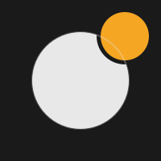

<p align="center">
  
</p>

# nudj

**Send push notifications from your CLI to your phone**

[](https://github.com/redneb/nudj/actions/workflows/ci.yml)
[](https://www.npmjs.com/package/nudj)
[](https://opensource.org/licenses/MIT)

---

## What is nudj?

nudj lets you send push notifications from your computer to your phone using a simple command-line tool. No account required, no servers — just Web Push and end-to-end encryption.

### Features

- 🔒 **End-to-end encrypted** — Only you can read your notifications
- 🚫 **No account required** — No sign-up, no login, no tracking
- 🌐 **Cross-platform** — Uses standard Web Push on supported iOS, Android, and desktop browsers
- ⚡ **Lightweight** — Single-file CLI, ~18KB PWA
- 🔓 **Open source** — MIT licensed, fully auditable

---

## Installation

### CLI

**Option 1: npm (recommended)**

```bash
npm install -g nudj
```

**Option 2: Single-file download**

```bash
# Download the latest release
curl -L https://github.com/redneb/nudj/releases/latest/download/nudj.js -o ~/.local/bin/nudj
chmod +x ~/.local/bin/nudj
```

Requires Node.js 22 or later.

---

## Quick Start

### 1. Install the PWA on your phone

Visit **[https://nudj.atopon.net](https://nudj.atopon.net)** on your phone.

**iOS users must install it as an app** (required for push notifications):

- **iOS**: Safari → Share → "Add to Home Screen" (required)
- **Android**: Chrome → Menu → "Install app" (optional — or just use the website). If notifications are delayed while your phone is idle, see [Notification delivery troubleshooting](#notification-delivery-troubleshooting).

Then tap **Enable Notifications** in the app.

### 2. Pair your phone with your computer

Copy the pairing code shown in the app, then on your computer:

```bash
nudj pair
# Paste the pairing code when prompted
# Give your phone a name (e.g., 'iPhone')
```

### 3. Send your first notification

```bash
nudj push 'Hello from my computer!'
```

That's it! You should see a notification on your phone.

---

## Notification delivery troubleshooting

nudj requests high-urgency delivery, but the operating system, browser, and push service ultimately control when a notification arrives.

### Android

If notifications are delayed while your phone is idle:

1. Open Android **Settings → Apps → Chrome → Battery** (the exact path varies by device).
2. Enable background usage and select **Unrestricted** battery usage.
3. Ensure Chrome can use background data.
4. Remove Chrome from any manufacturer-specific "sleeping apps" or battery-saving list.
5. Do not force-stop Chrome. Closing Chrome or swiping it away from recent apps should normally be fine.

Apply these settings to **Chrome**, not only to the installed nudj app. Chrome receives the Web Push message and starts nudj's service worker.

These changes can improve delivery while the phone is in a low-power state, but immediate delivery is not guaranteed. Unrestricted battery usage may also increase Chrome's background battery consumption.

### iOS and iPadOS

Web Push requires nudj to be installed as a Home Screen app. If notifications are missing or delayed:

1. Open **Settings → Apps → nudj → Notifications** and enable **Allow Notifications**.
2. Ensure nudj notifications are delivered immediately rather than through Scheduled Summary.
3. Check whether a Focus mode is suppressing nudj.
4. If delivery has stopped entirely, remove and reinstall the Home Screen app, then pair it again.

nudj requests immediate Web Push delivery on Apple devices, but this does not override Focus, Scheduled Summary, or other notification settings.

---

## CLI Reference

### Send a notification

```bash
nudj push 'Build completed'
nudj push --title 'CI' 'Build #1234 passed'
nudj push --to iPhone 'Your coffee is ready'
```

### Manage receivers

```bash
nudj receivers                        # List all paired devices
nudj receivers rename 'Old' 'New'     # Rename a device
nudj receivers remove 'Phone'         # Remove a device
```

### Configuration

```bash
nudj config                           # Show config file location
```

Configuration is stored at:
- Linux/macOS: `~/.config/nudj/config.json`
- Windows: `%APPDATA%\nudj\config.json`

---

## Privacy & Security

nudj is designed with privacy as a core principle:

- **No accounts** — You don't need to sign up for anything
- **No cloud storage** — Your credentials stay on your devices
- **No server** — nudj operates no servers and stores none of your data
- **End-to-end encryption** — Messages are encrypted using Web Push standards (RFC 8291)
- **No tracking** — The app creator has no access to your data

### How it works

1. Your phone generates encryption keys
2. You transfer a pairing code to your computer (containing the keys)
3. Your computer encrypts notifications using those keys
4. Only your phone can decrypt them

The push service (Google FCM, Apple APNs, Mozilla) only sees encrypted blobs — they cannot read your notification content.

### Security considerations

- Treat the pairing code like a password — anyone with it can send you notifications
- You can reset your subscription at any time to revoke all access
- Store your CLI config file securely (it contains the encryption keys)

---

## Development

### Prerequisites

- Node.js 22+
- npm

### Setup

```bash
git clone https://github.com/redneb/nudj.git
cd nudj
npm install
```

### Commands

```bash
npm run dev:cli          # Run CLI in development mode
npm run dev:web          # Start Vite dev server for PWA
npm run build            # Build everything
npm run build:cli        # Build CLI only
npm run build:web        # Build PWA only
npm run test             # Run all tests
npm run check            # Type check and lint
```

### Project Structure

```
src/
├── cli/          # CLI implementation (Node.js)
├── web/          # PWA implementation (Solid.js)
└── common/       # Shared type definitions
```

---

## License

MIT — see [LICENSE](LICENSE)

---

## Acknowledgments

Built with:
- [citty](https://github.com/unjs/citty) — CLI framework
- [Solid.js](https://www.solidjs.com/) — UI framework
- [@block65/webcrypto-web-push](https://github.com/block65/webcrypto-web-push) — Web Push library
